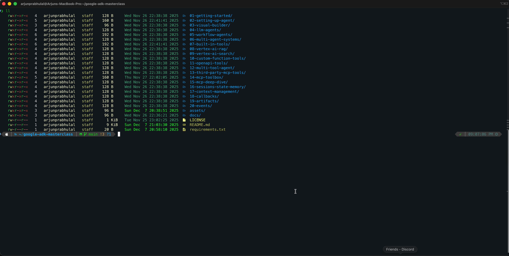

# 🌟 Google ADK Masterclass

<p align="center">
  <a href="https://arjunprabhulal.com/courses/adk-masterclass-hands-on-series/">
    
  </a>
</p>

<p align="center">
  <strong><a href="https://arjunprabhulal.com/courses/adk-masterclass-hands-on-series/">View Full Course</a></strong>
</p>

[](https://arjunprabhulal.com/courses/adk-masterclass-hands-on-series/)
[](https://google.github.io/adk-docs/)
[](LICENSE)
[](https://twitter.com/arjunprabhulal)

## 📖 Overview

Build production-ready AI agents with Google's Agent Development Kit (ADK). This hands-on masterclass covers everything from basic setup to advanced topics like multi-agent systems, memory management, and custom integrations.

**What this project offers:**

- 📚 Step-by-step tutorials progressing from fundamentals to advanced techniques
- 💻 Modular, ready-to-run code examples with minimal setup
- 🏗️ Reference architectures for building real-world AI agent applications

## ▶️ Demo

<!-- TODO: Replace with your demo GIF -->
<p align="center">
  
</p>

## 💡 Why This Exists

Learn ADK through hands-on projects. Each module pairs concepts with working code, progressing from basics to advanced multi-agent patterns.

## 🎯 Who Is This For

| If you are... | This is for you |
|---------------|-----------------|
| 🆕 New to AI agents | Start from Module 1, learn foundations first |
| 🔄 Coming from LangChain/CrewAI | Jump to Module 4+ for ADK-specific patterns |
| 🏗️ Building production systems | Focus on Modules 16-20 for state, memory, events |
| 🔧 Integrating tools/APIs | Modules 7-14 cover built-in and custom tooling |

## ✨ Features

- 📋 **Comprehensive curriculum** — 20 modules covering agents, workflows, tools, memory, and integrations
- 🖥️ **Multiple interfaces** — CLI, Web UI, and programmatic approaches for every example
- ⚙️ **Production patterns** — state management, callbacks, artifacts, and event streaming
- 🔧 **Extensible tooling** — built-in tools, custom functions, OpenAPI, and MCP integrations
- 📜 **MIT licensed** — free to use, modify, and deploy for personal or commercial projects

## 📚 Modules

### 🏁 Foundations
| # | Topic | Description | Blog |
|---|--------|-------------|------|
| 01 | [Getting Started](./01-getting-started/) | Introduction to ADK, environment setup, first agent | [Read](https://arjunprabhulal.com/adk-getting-started/) |
| 02 | [Setting Up Agents](./02-setting-up-agent/) | CLI, Web, and Programmatic setup methods | [Read](https://arjunprabhulal.com/adk-setting-up-agent/) |
| 03 | [Visual Builder](./03-visual-builder/) | No-code agent building with Visual Builder | [Read](https://arjunprabhulal.com/google-adk-visual-agent-builder/) |

### 🤖 Agent Types
| # | Topic | Description | Blog |
|---|--------|-------------|------|
| 04 | [LLM Agents](./04-llm-agents/) | Building intelligent LLM-powered agents | [Read](https://arjunprabhulal.com/adk-llm-agents/) |
| 05 | [Workflow Agents](./05-workflow-agents/) | Sequential, Parallel, and Loop patterns | [Read](https://arjunprabhulal.com/adk-workflow-sequential-loop-parallel/) |
| 06 | [Multi-Agent Systems](./06-multi-agent-systems/) | Agent orchestration and collaboration | [Read](https://arjunprabhulal.com/adk-multi-agent-systems/) |

### 🔧 Tools & Integrations
| # | Topic | Description | Blog |
|---|--------|-------------|------|
| 07 | [Built-in Tools](./07-built-in-tools/) | Google Search, Code Executor | [Read](https://arjunprabhulal.com/adk-built-in-tools/) |
| 08 | [Vertex AI RAG](./08-vertex-ai-rag/) | RAG Engine integration | [Read](https://arjunprabhulal.com/adk-builtin-tools-rag/) |
| 09 | [Vertex AI Search](./09-vertex-ai-search/) | Enterprise search integration | [Read](https://arjunprabhulal.com/adk-builtin-tools-vertex-search/) |
| 10 | [Custom Function Tools](./10-custom-function-tools/) | Building custom Python tools | [Read](https://arjunprabhulal.com/adk-custom-tools-function/) |
| 11 | [OpenAPI Tools](./11-openapi-tools/) | REST API integration | [Read](https://arjunprabhulal.com/adk-custom-tools-openapi/) |
| 12 | [Multi-Tool Agent](./12-multi-tool-agent/) | Combining multiple tools | [Read](https://arjunprabhulal.com/adk-multi-tool-agent/) |
| 13 | [Third-Party MCP Tools](./13-third-party-mcp-tools/) | GitHub, Firecrawl integration | [Read](https://arjunprabhulal.com/adk-third-party-tools-github/) |
| 14 | [MCP Toolbox for Databases](./14-mcp-toolbox/) | Database integration with MCP Toolbox | [Read](https://arjunprabhulal.com/adk-mcp-toolbox/) |

###  Protocols
| # | Topic | Description | Blog |
|---|--------|-------------|------|
| 15 | [Model Context Protocol](./15-mcp-deep-dive/) | MCP architecture and patterns | [Read](https://arjunprabhulal.com/adk-mcp-deep-dive/) |

### ⚙️ Core Components
| # | Topic | Description | Blog |
|---|--------|-------------|------|
| 16 | [Session, State & Memory](./16-sessions-state-memory/) | Conversation history and state management | [Read](https://arjunprabhulal.com/adk-sessions-state/) |
| 17 | [Context Management](./17-context-management/) | Caching and compaction | [Read](https://arjunprabhulal.com/adk-context-management/) |
| 18 | [Callbacks](./18-callbacks/) | Intercepting agent behavior | [Read](https://arjunprabhulal.com/adk-callbacks/) |
| 19 | [Artifacts](./19-artifacts/) | File and data handling | [Read](https://arjunprabhulal.com/adk-artifacts/) |
| 20 | [Events](./20-events/) | Event streaming and debugging | [Read](https://arjunprabhulal.com/adk-events/) |

## 📋 Prerequisites

**For most modules:**
- Python 3.10+
- Gemini API key from [AI Studio](https://aistudio.google.com/apikey)

**For Vertex AI modules (08, 09, 18):**
- See [GCP Setup Guide](./docs/GCP_SETUP.md) for detailed instructions

## 🚀 Quick Start

```bash
# Clone the repository
git clone https://github.com/arjunprabhulal/google-adk-masterclass.git
cd google-adk-masterclass

# Set up environment
echo "GOOGLE_API_KEY=your-api-key-here" > .env
```

### Option 1: Using uv (Recommended)

```bash
# Install uv if you haven't already
curl -LsSf https://astral.sh/uv/install.sh | sh

# Create virtual environment and install dependencies
uv venv && source .venv/bin/activate
uv pip install -r requirements.txt

# Run your first agent
cd 01-getting-started
adk web
```

### Option 2: Using pip

```bash
# Create virtual environment
python -m venv .venv
source .venv/bin/activate  # On Windows: .venv\Scripts\activate

# Install dependencies
pip install -r requirements.txt

# Run your first agent
cd 01-getting-started
adk web
```

## 🔗 Resources

- [ADK Documentation](https://google.github.io/adk-docs/)
- [ADK GitHub Repository](https://github.com/google/adk-python)
- [Course Homepage](https://arjunprabhulal.com/courses/adk-masterclass-hands-on-series/)
- [Author's Blog](https://arjunprabhulal.com/)

## 🤝 Contributing

Contributions are welcome! Whether it's:

- 🐛 Bug fixes
- 📝 Documentation improvements
- 💡 New module suggestions
- 🌟 Sharing your projects built with this masterclass

Please open an issue first to discuss what you'd like to change.

## 👤 Author

**Arjun Prabhulal**
- 🌐 Website: [arjunprabhulal.com](https://arjunprabhulal.com)
- 💻 GitHub: [@arjunprabhulal](https://github.com/arjunprabhulal)
- 🐦 Twitter: [@arjunprabhulal](https://twitter.com/arjunprabhulal)

## 📄 License

This project is licensed under the MIT License - see the [LICENSE](LICENSE) file for details.

---

<p align="center">
  ⭐ If you find this helpful, please star this repository and share with others!
</p>
